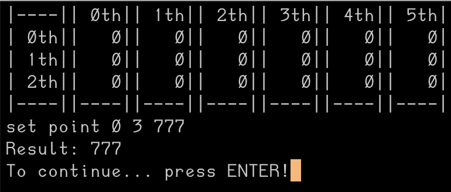
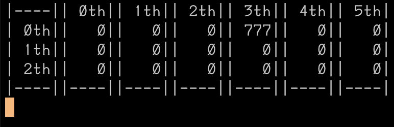
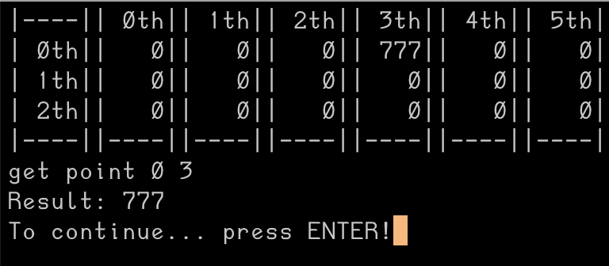

# Mini Excel

[How to Build](#how-to-build)

## Simple Table


## List commands


## Parameter





- Point Parameter

Usage: \
(command) point (row_index) (col_index) (set, default value is 0)

- Box Parameter

Usage: \
(command) box (row_index) (col_index) (width) (height) (set, default value is 0)

- List Parameter

Usage: \
(command) list (length) (data1, data2, data3 ...)

## Implement various methods
[Methods to be implemented](./method.h)


## Hot Compiling


# How to build

## Windows
### Caution
- Hot compiling is not available now.

```console
mkdir build
cd build
cmake ..
./src/mini-excel
```

## MacOS

```bash
mkdir build
cd build
cmake ..
cd ./src
./mini-excel
```
